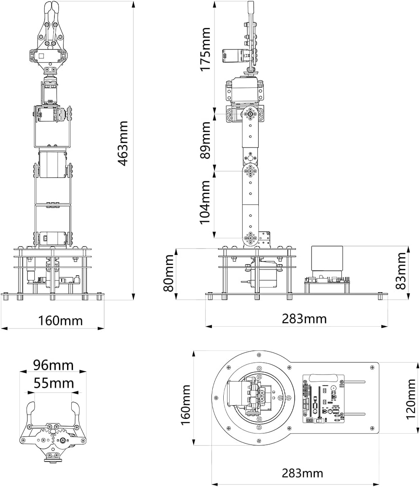
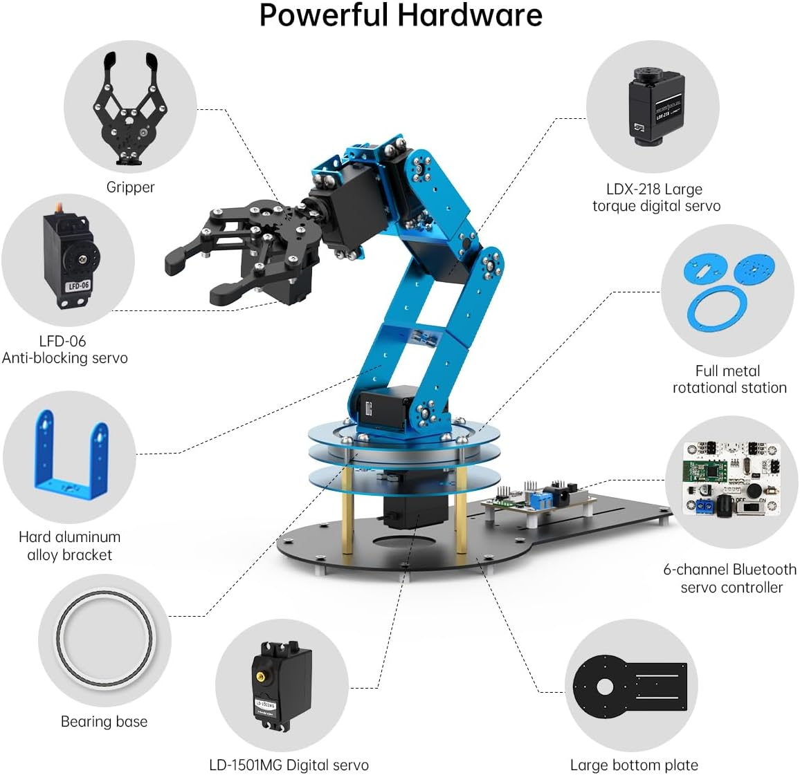
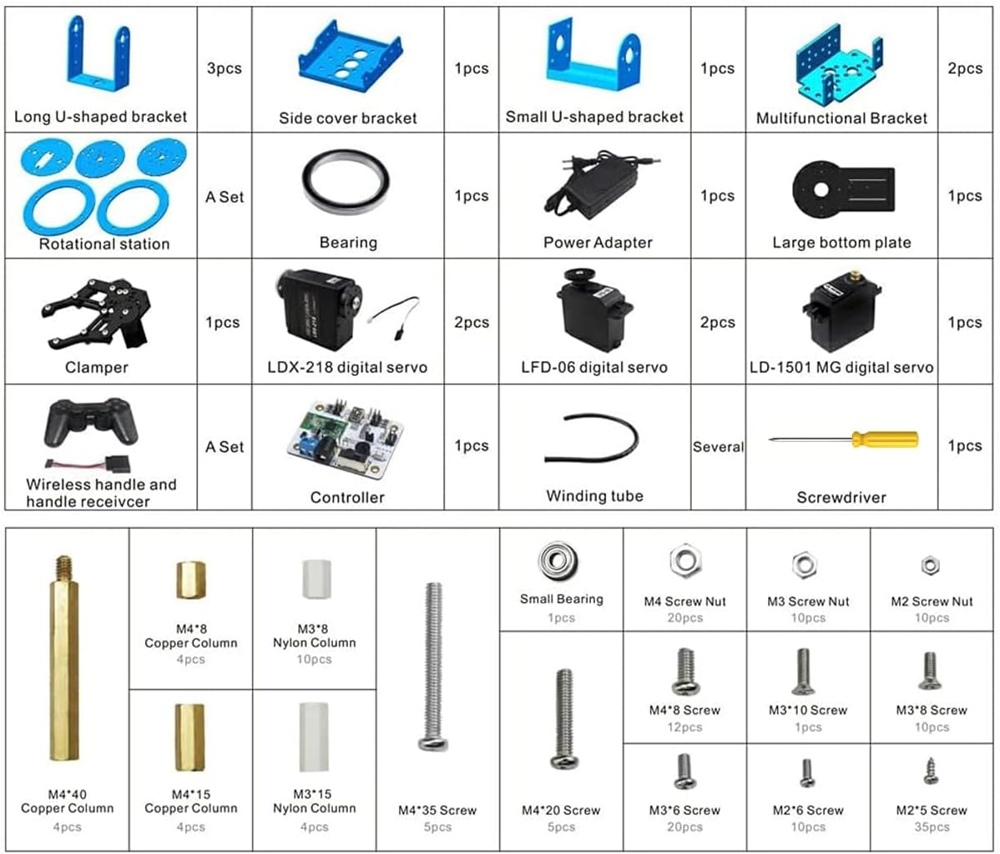
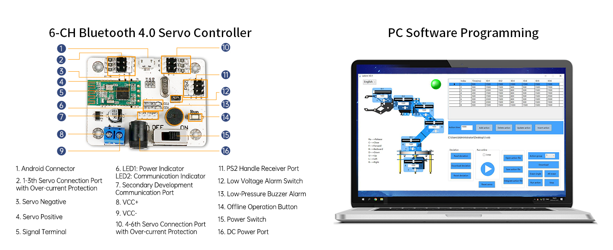
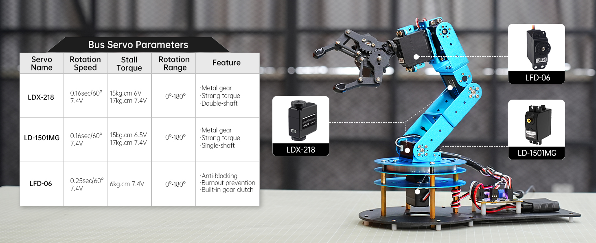

# Robotic Arm Kit 6DOF Programming Robot Arm with 5 Servo, Handle, Mechanical Claw and More, PC Software APP Control with Tutorial 

[Amazon](https://amzn.to/4jiTcto)

## Related projects 

https://github.com/ccourson/xArmServoController
https://www.hiwonder.com.cn/store/learn/25.html
Controller Installed

## Documentation

https://drive.google.com/drive/folders/1B7h0Q0HydRYi348VFJnfbAmWay4W_1Sd

LeArm has a  Controller LSC-6 https://www.hiwonder.com.cn/store/learn/25.html

